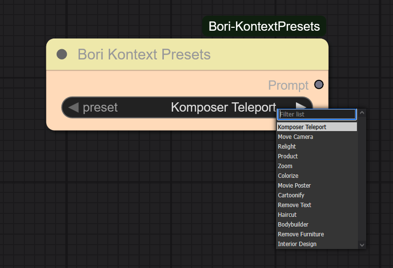

# ComfyUI-Bori-KontextPresets 
This is a custom node for ComfyUI that uses the Kontext Presets.

 
 
## Installation 
Clone into your `custom_nodes/` folder inside ComfyUI: 
git clone https://github.com/boricuapab/ComfyUI-Bori-KontextPresets.git 
